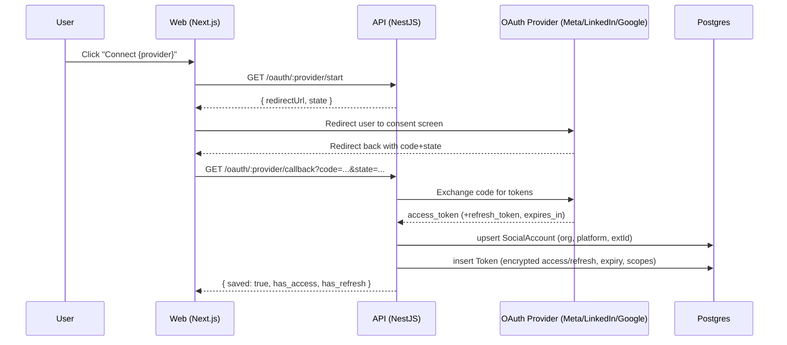
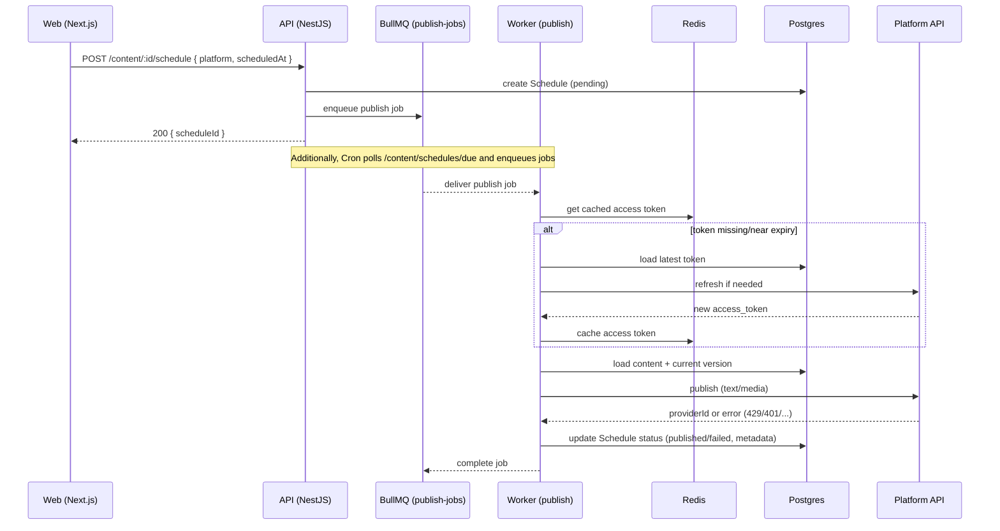
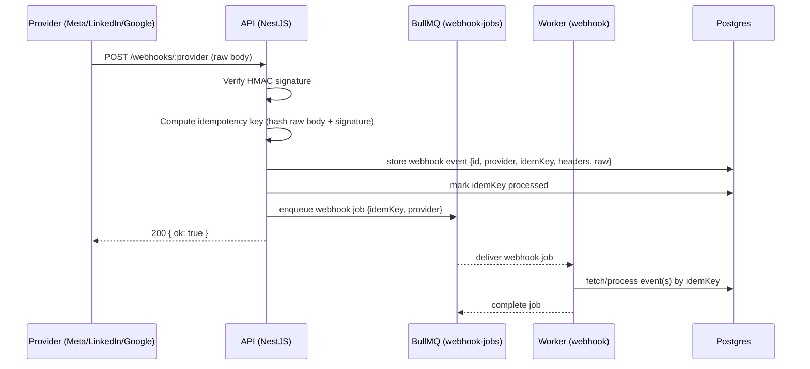

## Agent Bowery Architecture and Flow Diagrams

This document provides a high-level system architecture diagram and sequence diagrams for the OAuth connect flow, the publish flow, and webhook processing.

### System Architecture

```mermaid
graph TD
  subgraph Client
    W[Web (Next.js Dashboard)]
  end

  subgraph API[NestJS API]
    Ctrls[Controllers: content, oauth, webhooks, posts, jobs, health, token]
    Mid[Middlewares: correlation, rate-limit, idempotency]
    Filt[GlobalHttpExceptionFilter]
    SvcToken[TokenService]
    SvcContentAd[ContentAdaptationService]
    SvcContentAp[ContentApprovalService]
    SvcPublish[PlatformPublishService]
    SvcPlatform[PlatformService]
    CliMeta[MetaClientService]
    CliLinkedIn[LinkedInClientService]
    SvcQueue[QueueService (BullMQ producers)]
  end

  subgraph Worker[Worker (BullMQ)]
    WkrPublish[publish-jobs]
    WkrWebhook[webhook-jobs]
    Cron[cron sweeper]
  end

  subgraph Data
    DB[(PostgreSQL)]
    Redis[(Redis)]
  end

  subgraph Providers
    Meta[Meta (FB/IG)]
    LinkedIn[LinkedIn]
    Google[Google/GBP]
    YouTube[YouTube]
  end

  W -->|REST| Ctrls
  Ctrls --> Mid
  Ctrls --> Filt
  Ctrls --> SvcToken
  Ctrls --> SvcContentAd
  Ctrls --> SvcContentAp
  Ctrls --> SvcPublish
  Ctrls --> SvcPlatform
  Ctrls --> SvcQueue

  SvcToken <-->|cache| Redis
  SvcToken -->|read/write| DB
  SvcContentAp -->|store previews/approvals| DB
  SvcPublish -->|content/schedules| DB
  SvcPublish --> CliMeta
  SvcPublish --> CliLinkedIn

  SvcPlatform --> Meta
  SvcPlatform --> LinkedIn
  SvcPlatform --> Google
  SvcPlatform --> YouTube

  Ctrls -. webhooks .->|/webhooks/*| Providers
  Providers -->|Webhook POST| Ctrls

  SvcQueue -->|enqueue publish/webhook| WkrPublish
  SvcQueue -->|enqueue webhook| WkrWebhook

  Cron -->|poll /content/schedules/due| Ctrls
  Cron -->|enqueue publish| WkrPublish

  WkrPublish -->|get token| Redis
  WkrPublish -->|fallback| DB
  WkrPublish -->|post media/content| Providers
  WkrPublish -->|record outcome| DB

  WkrWebhook -->|process events| DB
```

### OAuth Connect Flow



### Publish Flow (Schedule → Queue → Worker → Provider)



### Webhook Processing Flow



### Notes
- Role-based access guards protect content routes (`GatewayAuthGuard`, `RolesGuard`).
- Images/videos are processed per-platform (dimensions/format) before upload.
- Retries/backoff are handled by BullMQ; 401s imply token refresh, 429s imply backoff.


